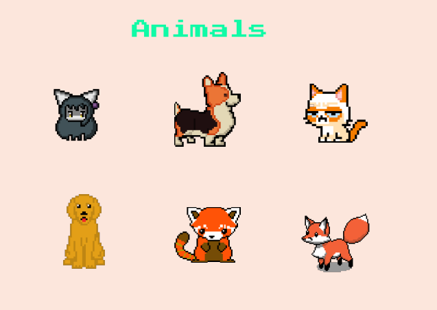

# La Costa tour :red_car:

The old known 2D Nintendo game but more "la monda"😎, developed in Java and Processing🧍.

#### Demostration video

### Table of Contents

[Features](#Features)
[Installing](#Installing)

## Features

### Main Screen

- Race: start the game.
- Garage: choose the color of the car.
- Options: enable or disable music and choose the difficulty of the game.
- Credits: display a window showing information about the creators of the game.

### Carrera

The main objective of this game mode is to reach the finish line by dodging all the vehicles on the road and catching as many animals as possible.

* #### Scenarios

  The game has 3 scenarios which are cities of the Colombian Caribbean coast.

  * ##### Sincelejo

    
  * ##### Cartagena

    
  * ##### Barranquilla

    
* #### Actions - Event

  * **Loss of a life**: This occurs when the player collides with an enemy car. This causes the car to reset its position.

    
  * **Increase of one life**: This event will occur every time the player picks up one animal that appear randomly on the road. animals that appear randomly on the road, i.e. if the player has 2 lives and then picks up two animals player has 2 lives and subsequently picks up two animals without colliding with another car, he will then have 3 lives

    
  * **End game:** In the costa tour there are two events that cause the game to end.

    * When the player runs out of lifes. You can choose reset the game or exit to main screen.
    * And when the player crosses the finish line. Also you can choose eset the game or exit to main screen.
  * Game speed increases every 20 seconds. Don't be overconfident.
* ### Enemies

  Are the cars that appear on the road, which the player must dodge to avoid crashing.
  not to crash.

  
* ### Animals

  There are a variety of animals along the road that must be collected to earn lives.

  

### Free Race

This is an infinite game mode whose mechanics are similar to those of the career mode with the difference that the objective is not to reach the finish line, but to stay alive as long as possible. The player can choose the scenario of his preference to play.

### Garage

You can choose the color of your choice for your car.

### Options

You can enable or disable music and choose the difficulty of the game.

---

[ErSantis](https://github.com/ErSantis)

[Jandres02](https://github.com/Jandres02)

[joaco-valenverguen](https://github.com/joaco-valenverguen)
